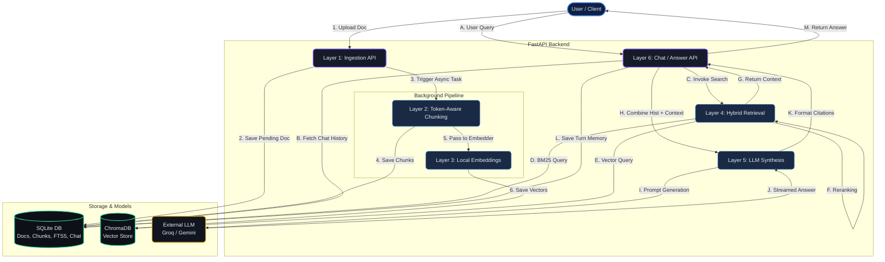
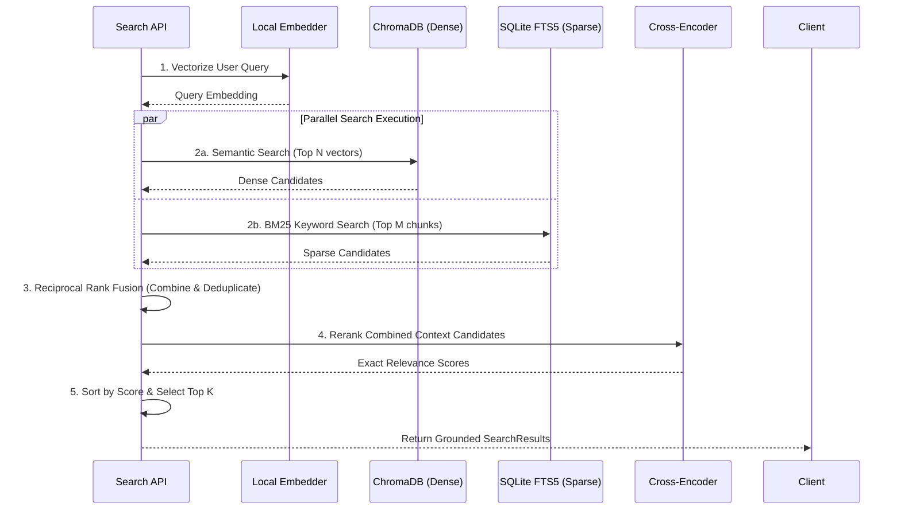
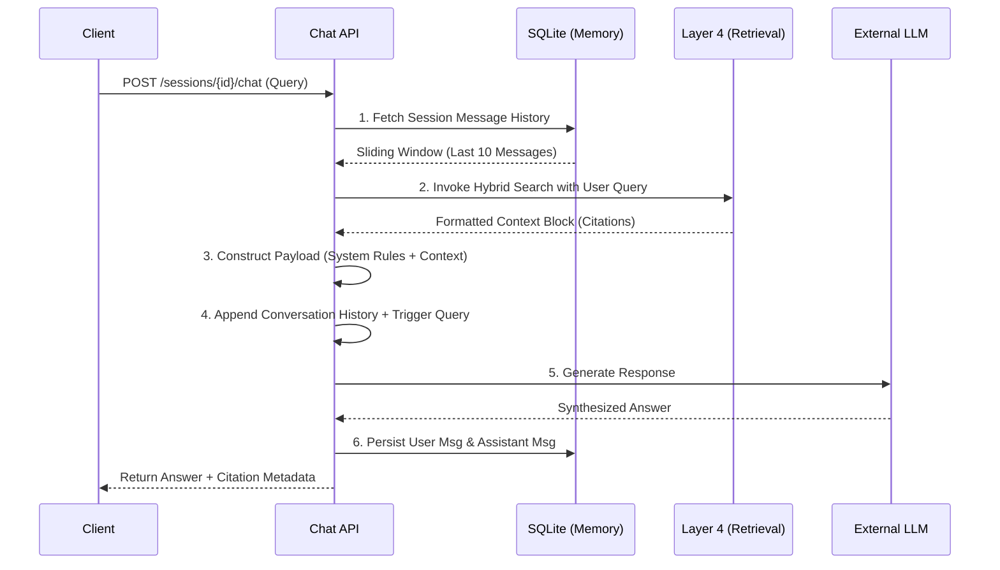

<div align="center">
  <br />
  <h1>VERO API Architecture Guide</h1>
  <p><strong>State-of-the-Art (SOTA) Reference for the VERO Research Workspace Engine</strong></p>
  <br />
</div>

VERO is designed as a strict, layered 6-tier architecture. Each layer builds upon the outputs of the previous, transforming raw, unstructured documents into a mathematically grounded, conversational intelligence system.

This guide provides the complete flow logic and endpoint specifications necessary for frontend or client integration.

---

## Global Architecture Flow

The entire VERO backend operates on an explicit pipeline, heavily optimized with asynchronous processing and local cryptographic caching to prevent redundant compute.



---

## Global Headers

Unless otherwise specified, standard API requests require:
- `Accept`: `application/json`
- `Content-Type`: `application/json`

---

## 1. Layer 1: Ingestion & Deduplication

Transforms diverse multi-modality sources into normalized text records, calculating SHA-256 hashes to prevent duplicate compute.

### `POST /projects`
Creates a unique multi-document workspace container.
- **Request Body**:
  ```json
  {
    "name": "Quantum Computing Papers 2024",
    "description": "Optional metadata"
  }
  ```
- **Response `201 Created`**: Returns a `ProjectModel` with a generated UUID (`id`).

### `POST /projects/{project_id}/ingest`
Uploads binary files (PDF, DOCX, MD, TXT). Uses `multipart/form-data`.
- **Headers**: `Content-Type: multipart/form-data`
- **Body**: `file` (binary)
- **Response `201 Created`**: Returns a `DocumentSummary`. Note: the `processing_status` will be `"pending"` as Layer 6 automatically takes over background chunking/embedding.

### `POST /projects/{project_id}/ingest-repo`
Recursively clones a public GitHub repo, extracting all READMEs and Python docstrings.
- **Body**:
  ```json
  {
    "repo_url": "https://github.com/GwadeSteve/VERO",
    "title": "Optional Override Title"
  }
  ```

---

## 2. Layer 2: Reversible SOTA Chunking

Breaks massive text blocks down into token-optimized shards, preserving semantic boundaries and markdown hierarchy (breadcrumbs).

### `POST /documents/{doc_id}/chunk`
*Triggered automatically by Layer 6, but available manually.*
- **Action**: Applies `tiktoken` limits alongside semantic sentence splitting or Markdown header awareness.
- **Response `201 Created`**: Returns an array of `ChunkResponse`.

### `GET /documents/{doc_id}/chunks`
- **Response `200 OK`**:
  ```json
  [
    {
      "id": "e4f8b2",
      "text": "[Root > Installation]\nClone the repo...",
      "start_char": 450,
      "end_char": 890,
      "token_count": 112,
      "strategy": "markdown"
    }
  ]
  ```

---

## 3. Layer 3: Versioned Vector Embeddings

Generates 384-dimensional dense vectors using a fast, local-first model (`all-MiniLM-L6-v2`) via `sentence-transformers`. Skips chunk hashes that haven't changed.

### `POST /documents/{doc_id}/embed`
*Triggered automatically by Layer 6, but available manually.*
- **Action**: Calculates embeddings and upserts them into persistent ChromaDB storage.
- **Response `201 Created`**:
  ```json
  [
    {
      "chunk_id": "e4f8b2",
      "model_name": "all-MiniLM-L6-v2",
      "dimension": 384,
      "is_cached": false 
    }
  ]
  ```

---

## 4. Layer 4: Hybrid Retrieval Pipeline

The heart of VERO's accuracy. Performs concurrent sparse (keyword) and dense (semantic) searches, fuses the results mathematically via RRF (Reciprocal Rank Fusion), and sends the top candidates through an ultra-precise Cross-Encoder neural network to perfectly rank relevance.



### `POST /projects/{project_id}/search`
- **Body**:
  ```json
  {
    "query": "How is context preserved during chunking?",
    "top_k": 5,
    "mode": "hybrid" 
  }
  ```
  *(Modes: `hybrid`, `semantic`, `keyword`)*

### `POST /projects/{project_id}/search/context`
A specialized search endpoint that bundles the returned chunks into an optimal prompt-ready format for direct LLM injection.

---

## 5. Layer 5: Grounded Answering System

Replaces hallucination-prone generation with strict synthesis. The LLM acts purely as a summarizer over the retrieved search constraints.

### `POST /projects/{project_id}/answer`
*(One-shot/Stateless endpoint)*
- **Body**:
  ```json
  {
    "query": "What formats does VERO support?",
    "top_k": 3,
    "allow_model_knowledge": false
  }
  ```
  - `allow_model_knowledge` (default `false`): When `false`, the LLM is strictly grounded in document evidence only. When `true`, the LLM may supplement with its training knowledge while still prioritizing document citations.
- **Response `200 OK`**:
  ```json
  {
    "answer": "VERO supports multiple formats, including ...",
    "citations": [
      {
        "chunk_id": "e4f8b2",
        "doc_id": "a1b2c3",
        "doc_title": "README.md",
        "text": "...",
        "start_char": 450,
        "end_char": 890,
        "source_url": null,
        "score": 0.8412
      }
    ],
    "found_sufficient_info": true
  }
  ```
  Each citation includes `doc_id`, `chunk_id`, `start_char`, and `end_char` for precise UI highlighting of exactly which passage in which document was used.

---

## 6. Layer 6: Conversational Intelligence (SOTA)

Layer 6 elevates VERO from a basic RAG system to an autonomous, context-aware memory agent.

### The Auto-Pipeline
Uploading a document in Layer 1 triggers a thread-pooled background task. Check `GET /documents/{doc_id}` and monitor the `processing_status` property (`pending` → `processing` → `ready`).

### Memory Architecture Flow
The chat history implements a sliding-window retention policy to prevent token overflow.



### `POST /projects/{project_id}/sessions`
- **Body**:
  ```json
  {
    "title": "Architecture Research Chat"
  }
  ```
- **Response `201 Created`**: Returns `SessionResponse`.

### `GET /sessions/{session_id}`
Returns the entire saved chronological conversation tree.
- **Response `200 OK`**:
  ```json
  {
    "id": "abc-123",
    "title": "Architecture Research Chat",
    "messages": [
      { "role": "user", "content": "Tell me about Layer 2." },
      { "role": "assistant", "content": "Layer 2 handles chunking..." }
    ]
  }
  ```

### `POST /sessions/{session_id}/chat`
The pinnacle interaction point. Sends a message into an active session. The model automatically loads the conversation history, allowing it to easily resolve pronouns (e.g., *"How do I install it?"* resolving *"it"* from previous turns).
- **Body**:
  ```json
  {
    "message": "Can I replace the chunking strategy?",
    "top_k": 5,
    "mode": "hybrid",
    "allow_model_knowledge": false
  }
  ```
- **Response `200 OK`**: Returns a `ChatResponse` with `answer`, `citations` (including `doc_id`, `chunk_id`, `start_char`, `end_char` for UI highlighting), and `found_sufficient_info`. Citations are tied and persisted to the session.
