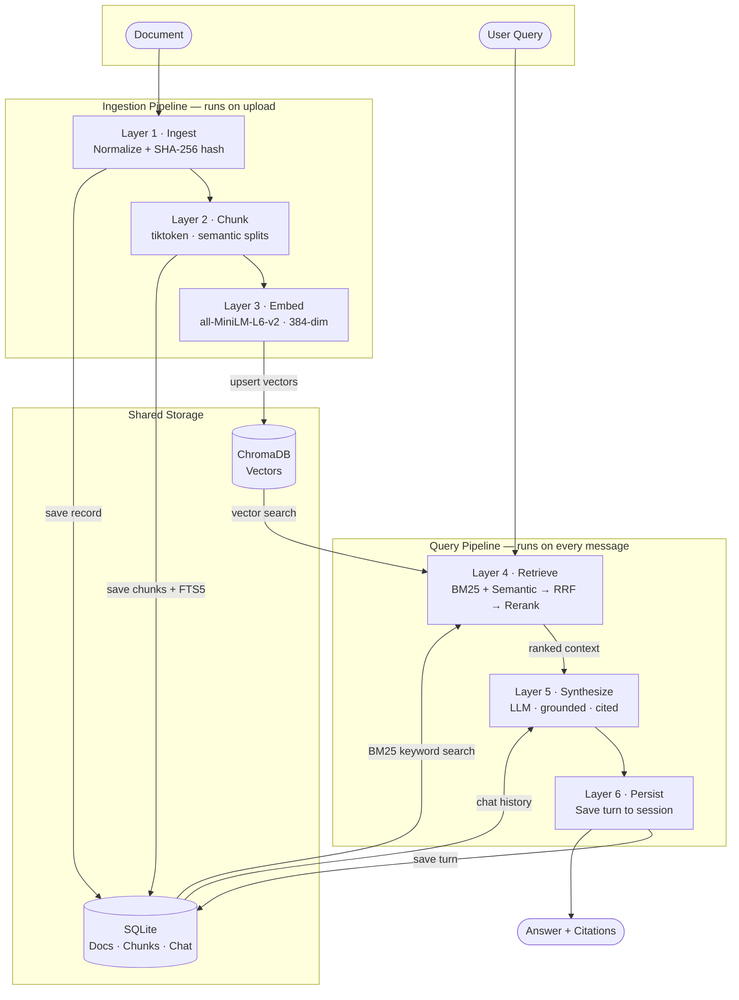
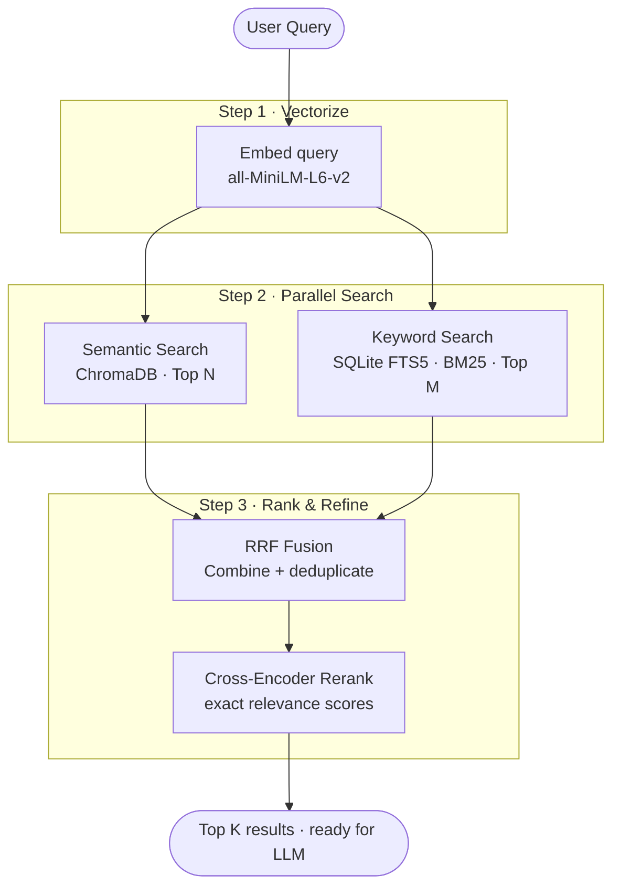
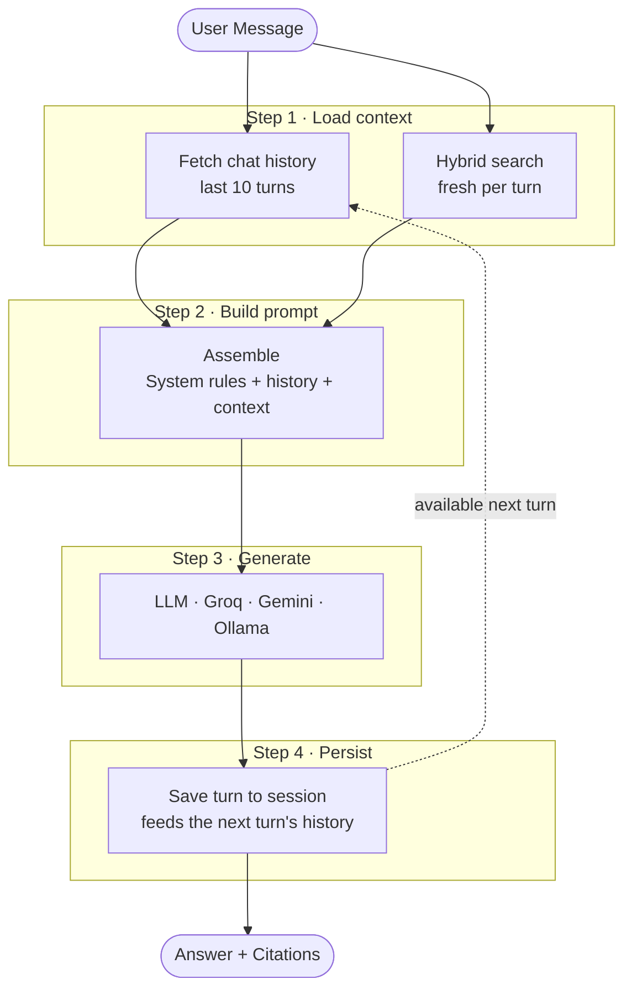

# VERO: Research Workspace Engine

[](https://www.python.org/)
[](https://fastapi.tiangolo.com/)
[](https://www.sqlite.org/)
[](https://www.trychroma.com/)
[](https://groq.com/)
[](https://ai.google.dev/)

**VERO** is an advanced, privacy-first research workspace engine built for high-fidelity information retrieval and synthesis. It prioritizes data integrity, deterministic processing, and strict source traceability.

> **Interactive docs:** [View the SOTA API Architecture Guide](API_Guide.html)

---

## Core Architecture

VERO is built on a hardened, 6-layer framework. Every module is independently verifiable, ensuring zero data loss from raw document to final LLM synthesis.

| Layer | Name | Purpose |
|:-----:|------|---------|
| **1** | Ingestion | Normalize inputs, SHA-256 deduplication |
| **2** | Chunking | Token-aware splits, markdown hierarchy preserved |
| **3** | Embeddings | Local `all-MiniLM-L6-v2` · 384-dim · hash-cached |
| **4** | Retrieval | BM25 + Semantic → RRF fusion → Cross-Encoder rerank |
| **5** | Answering | LLM synthesis strictly grounded in retrieved context |
| **6** | Memory | Persistent sessions with sliding-window history |

---

## System Architecture

VERO handles two independent flows — **document ingestion** and **query answering** — that share the same storage layer.



---

## Technical Stack

| Component | Technology |
|-----------|-----------|
| API Framework | FastAPI (Async Python) |
| Database | SQLite + SQLAlchemy (Asyncio) |
| Parsers | PyMuPDF · python-docx · BeautifulSoup4 · GitHub REST API |
| Embeddings | `sentence-transformers` — `all-MiniLM-L6-v2` |
| Reranking | `ms-marco-MiniLM-L-6-v2` Cross-Encoder |
| Vector Store | ChromaDB (persistent, local) |
| LLM Providers | Groq · Google Gemini · Ollama |

---

## Getting Started

### Prerequisites
- Python 3.10+
- Git

### Installation

```bash
# 1. Clone and enter the backend directory
git clone https://github.com/GwadeSteve/VERO.git
cd VERO/backend

# 2. Create a virtual environment
python -m venv venv
source venv/bin/activate      # Windows: .\venv\Scripts\activate

# 3. Install
pip install -e .
```

**Configure environment** — create a `.env` file in `backend/`:

```env
GEMINI_API_KEY="your_key_here"
GROQ_API_KEY="your_key_here"
```

### Run

```bash
# Start the server (Swagger UI at http://localhost:8000/docs)
python -m uvicorn app.main:app --reload --port 8000

# Or use the interactive terminal REPL
python demo.py
```

### LLM Providers

Switch providers with a single env variable:

| Provider | Config |
|----------|--------|
| **Groq** *(default · fastest)* | `VERO_LLM_PROVIDER=groq` + `GROQ_API_KEY` |
| **Gemini** | `VERO_LLM_PROVIDER=gemini` + `GEMINI_API_KEY` |
| **Ollama** *(local · no API key)* | `VERO_LLM_PROVIDER=ollama` + `ollama pull llama3.1` |

---

## API Guide

### Layer 1 — Ingestion

Upload a file and VERO automatically hashes, chunks, and embeds it in the background.

```bash
POST /projects/{id}/ingest          # Upload file (PDF, DOCX, MD, TXT)
POST /projects/{id}/ingest-repo     # Pull a GitHub repo's READMEs + docstrings
GET  /documents/{doc_id}            # Check processing_status: pending → processing → ready
```

---

### Layer 4 — Hybrid Retrieval

A two-stage pipeline that combines keyword precision with semantic understanding, then reranks the fused results for maximum accuracy.



> **Why two stages?** BM25 catches exact keyword matches that semantic search misses. RRF ensures neither dominates. The Cross-Encoder then gives a precise relevance score per candidate — something fast bi-encoders can't do.

```bash
POST /projects/{id}/search
{
  "query": "How is context preserved during chunking?",
  "top_k": 5,
  "mode": "hybrid"    # also: "semantic" | "keyword"
}
```

---

### Layer 5 — Grounded Answering

```bash
POST /projects/{id}/answer
{
  "query": "What formats does VERO support?",
  "top_k": 3,
  "allow_model_knowledge": false
}
```

Set `allow_model_knowledge: true` to let the LLM supplement with training knowledge when documents are insufficient. Default is `false` — answers are **strictly** grounded in your documents.

Each citation includes `doc_id`, `chunk_id`, `start_char`, and `end_char` for precise UI passage highlighting:

```json
{
  "answer": "VERO supports PDF, DOCX, Markdown, and TXT...",
  "citations": [
    {
      "doc_id": "a1b2c3",
      "chunk_id": "e4f8b2",
      "doc_title": "README.md",
      "start_char": 450,
      "end_char": 890,
      "score": 0.8412
    }
  ],
  "found_sufficient_info": true
}
```

---

### Layer 6 — Conversational Memory

Each session keeps a **sliding window of the last 10 messages**. On every turn, VERO fetches history, runs a fresh hybrid search, and builds a grounded prompt — enabling natural follow-ups and pronoun resolution across turns.



```bash
POST /projects/{id}/sessions        # Create a named session
POST /sessions/{id}/chat            # Send a message
GET  /sessions/{id}                 # Retrieve full conversation history
```

---

## Development Status

- [x] **Layer 1** — Hardened Ingestion: SHA-256 dedup, multi-format parsers, integrity scores
- [x] **Layer 2** — Reversible Chunking: `tiktoken` limits, markdown header preservation
- [x] **Layer 3** — Versioned Embeddings: local-first, cryptographic hash versioning
- [x] **Layer 4** — Hybrid Retrieval: Vector + BM25 via RRF, Cross-Encoder reranking
- [x] **Layer 5** — Grounded Answering: multi-provider LLM, mandatory citations, refusal logic
- [x] **Layer 6** — Conversational Memory: background auto-pipeline, persistent sessions
- [ ] **Layer 7** — UI Implementation (pending)