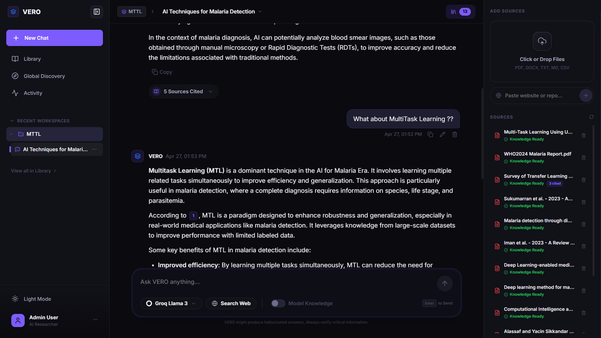
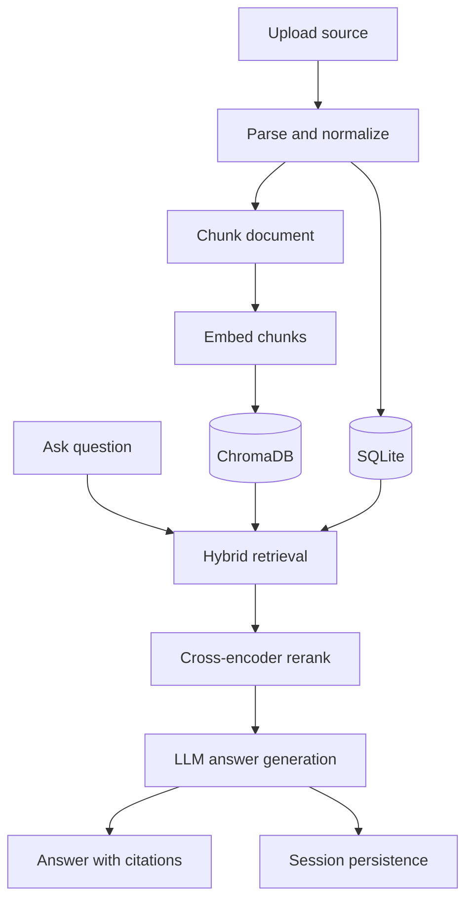

<p align="center">
  
</p>

<h1 align="center">VERO</h1>

<p align="center">
  <strong>VERO: Grounded Research Workspace</strong>
</p>

<p align="center">
  A full-stack AI system for ingesting files, links, and repositories, then answering with retrieved evidence and citations.
</p>

<p align="center">
  <a href="#demo">Demo</a> •
  <a href="#why-vero">Why VERO</a> •
  <a href="#capabilities">Capabilities</a> •
  <a href="#architecture">Architecture</a> •
  <a href="#project-guide">Project Guide</a> •
  <a href="#run-locally">Run Locally</a>
</p>

<p align="center">
  <a href="https://www.python.org/"></a>
  <a href="https://fastapi.tiangolo.com/"></a>
  <a href="https://react.dev/"></a>
  <a href="https://www.sqlite.org/"></a>
  <a href="https://www.trychroma.com/"></a>
  <a href="https://github.com/features/actions"></a>
</p>

---

## Demo

<p align="center">
  
</p>

<p align="center">
  Search, ingest, chat, and verify sources inside a single project-scoped research workspace.
</p>

VERO is designed around a practical workflow:

1. Create a workspace for a project or research topic.
2. Ingest PDFs, DOCX, Markdown, CSV, web pages, or a public GitHub repository.
3. Run search or ask a question against indexed material.
4. Review citations, supporting chunks, and persistent session history.

---

## Why VERO

VERO is not a generic chat wrapper. It is a retrieval product with an actual system behind it.

- It keeps knowledge isolated by workspace so research stays scoped and usable.
- It retrieves and reranks evidence before answer generation, which improves traceability and reduces hand-wavy responses.
- It combines ingestion, search, grounded answering, and session continuity in one full-stack application.

That makes it useful as both a product showcase and a serious engineering project.

---

## Capabilities

| Area | What VERO does |
| --- | --- |
| Ingestion | Imports PDFs, DOCX, Markdown, TXT, CSV, URLs, and public repositories |
| Processing | Parses, chunks, embeds, and indexes source material in the background |
| Retrieval | Supports semantic, keyword, and hybrid search with reranking |
| Answering | Generates grounded responses from retrieved context with citations |
| Memory | Preserves sessions and history inside each workspace |
| Product UX | Exposes projects, discovery, activity, and chat in a coherent interface |
| Model Flexibility | Supports Groq, Gemini, and Ollama providers |

---

## Architecture

VERO is built as a six-layer retrieval pipeline:

| Layer | Responsibility | Implementation |
| --- | --- | --- |
| 1 | Ingestion | File, URL, and repository parsing with deduplication |
| 2 | Chunking | Source-aware segmentation with metadata preservation |
| 3 | Embeddings | Local sentence-transformer vectors stored in Chroma |
| 4 | Retrieval | Semantic + BM25-style search with reciprocal rank fusion |
| 5 | Answering | Grounded response generation from retrieved chunks |
| 6 | Memory | Persistent sessions and history-aware prompting |



### Operational details

- The backend exposes `GET /health` and `GET /ready` separately so the API can come online before heavy model warmup completes.
- Embeddings and reranker models warm in the background to reduce blocking startup behavior.
- Answers are generated only after retrieval and reranking, not as unconstrained completions.
- Citations preserve chunk and document references for UI traceability.

---

## Stack

### Backend

- FastAPI
- SQLAlchemy async + SQLite
- ChromaDB
- sentence-transformers
- rank-bm25
- PyMuPDF
- pdfplumber
- python-docx
- python-pptx
- BeautifulSoup

### Frontend

- React
- Vite
- React Router
- Recharts
- KaTeX

### Model providers

- Groq
- Gemini
- Ollama

---

## Project Guide

The repository is split into a backend pipeline, a frontend product surface, and deployment-quality support files.

### Top-level layout

| Path | Purpose |
| --- | --- |
| `backend/` | FastAPI backend, retrieval pipeline, ingestion logic, and persistence |
| `frontend/` | React application for projects, workspace chat, discovery, and activity |
| `.github/workflows/` | CI checks for backend validation and frontend build/launch verification |
| `docs/` | README assets such as product images and previews |

### Backend guide

| Path | Responsibility |
| --- | --- |
| `backend/app/main.py` | API entrypoint, startup lifecycle, health, and readiness endpoints |
| `backend/app/routers/` | HTTP routes for chat, projects, documents, and activity |
| `backend/app/parsers/` | Source parsers for files, URLs, and repository content |
| `backend/app/chunks/` | Chunking logic and metadata-aware segmentation |
| `backend/app/embeddings/` | Embedder selection, local embedding model loading, and vector generation |
| `backend/app/retrieval.py` | Hybrid retrieval orchestration and ranking flow |
| `backend/app/reranker.py` | Cross-encoder reranking for result refinement |
| `backend/app/answering.py` | Grounded answer construction from retrieved context |
| `backend/app/warmup.py` | Background model warmup and readiness coordination |
| `backend/app/database.py` | Async database setup and SQLAlchemy integration |

### Frontend guide

| Path | Responsibility |
| --- | --- |
| `frontend/src/App.jsx` | App shell, startup state handling, routing, and warmup polling |
| `frontend/src/pages/` | Product pages for workspace, discovery, activity, and project views |
| `frontend/src/api.js` | Backend client, startup checks, and request helpers |
| `frontend/src/components/` | Shared UI building blocks used across product surfaces |
| `frontend/public/vero.svg` | VERO brand mark used by the application and README |

### How the system fits together

- The backend owns ingestion, retrieval, answering, and persistence.
- The frontend presents that pipeline as a usable product rather than a bare API client.
- Chroma stores vector representations, while SQLite stores project, document, and session state.
- The result is a local-first research workspace with a full RAG loop and a navigable interface.

---

## Run Locally

### Prerequisites

- Python 3.10+
- Node.js 20+
- Git

### Backend

```bash
cd backend
python -m venv venv
source venv/bin/activate      # Windows: .\venv\Scripts\activate
pip install -e .[dev]
```

Create `backend/.env`:

```env
GROQ_API_KEY="your_key_here"
GEMINI_API_KEY="your_key_here"
VERO_LLM_PROVIDER="groq"
```

Run the API:

```bash
python -m uvicorn app.main:app --reload --port 8000
```

Useful endpoints:

- `GET /health` for process health
- `GET /ready` for model readiness

### Frontend

```bash
cd frontend
npm install
npm run dev
```

---

## Validation

GitHub Actions currently checks:

- backend install and audit flow
- frontend production build
- frontend preview launch

Useful local checks:

```bash
# backend
cd backend
python -m compileall app

# frontend
cd frontend
npm run build
```

---

## API Surface

```text
POST /projects
POST /projects/{project_id}/ingest
POST /projects/{project_id}/ingest-url
POST /projects/{project_id}/ingest-repo
POST /projects/{project_id}/search
POST /projects/{project_id}/answer
POST /projects/{project_id}/sessions
POST /sessions/{session_id}/chat
GET  /documents
GET  /activity/metrics
```

---

## Portfolio Value

VERO demonstrates practical work in:

- retrieval-augmented generation
- full-stack product engineering
- asynchronous ingestion and indexing workflows
- search and reranking pipeline design
- operational AI UX and readiness handling

## Status

VERO is operational as a local-first research workspace and still has room to grow in:

- streaming UX
- evaluation coverage
- deployment hardening
- broader connector support
